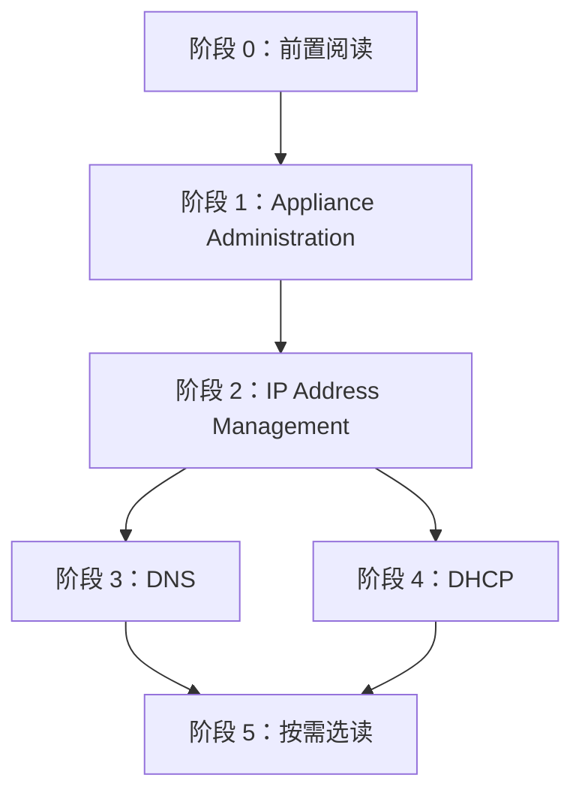

# Administering NIOS Quick Study

面向零基础读者的 **Administering NIOS** 速成路线。官方该章约 1800+ 页，这里是「读什么、什么顺序、为什么」的导读，不是替代全文。

完整章节入口：[Administering NIOS](/nios90/infoblox-nios-9-0-x/administering-nios/)

---

## 0. 先搞懂 NIOS 在管什么

NIOS 是 Infoblox 的 **DDI 平台**，日常管理围绕三件事：

| 知识点 | 一句话 | 对应章节 |
| --- | --- | --- |
| **IPAM** | 网段、IP 地址谁在用、怎么规划 | [IP Address Management](/nios90/infoblox-nios-9-0-x/administering-nios/ip-address-management/) |
| **DNS** | 域名 → IP 的解析 | [DNS](/nios90/infoblox-nios-9-0-x/administering-nios/dns/) |
| **DHCP** | 设备连网时自动分配 IP | [DHCP](/nios90/infoblox-nios-9-0-x/administering-nios/dhcp/) |

### 必记架构概念

读 Administering NIOS 之前，这些词会反复出现（Infoblox 定义可能与别家不同）：

| 概念 | 你需要知道的 |
| --- | --- |
| **Appliance** | 一台 NIOS 设备（物理机 / VM） |
| **Grid** | 多台 Appliance 组成的管理集群，数据与服务可集中管理 |
| **Grid Master** | Grid 里维护主数据库、做全局配置的节点 |
| **Grid Member** | Grid 中的成员节点，可分担 DNS/DHCP 等服务 |
| **Grid Manager** | Web 管理界面，日常操作的主入口 |
| **HA（High Availability）** | 主备成对部署，故障时切换，减少单点故障 |

详细定义 → [Glossary of Terms](/nios90/infoblox-nios-9-0-x/getting-started/glossary-of-terms)

---

## 1. 前置阅读（进 Administering NIOS 之前）

Administering NIOS 默认你已经会用 Grid Manager。建议先完成：

| 顺序 | 读什么 | 链接 |
| --- | --- | --- |
| 1 | 官方入门索引 | [Getting Started](/nios90/infoblox-nios-9-0-x/getting-started/) |
| 2 | 术语表（不必背，知道能查） | [Glossary of Terms](/nios90/infoblox-nios-9-0-x/getting-started/glossary-of-terms) |
| 3 | Grid Manager 是什么 | [About the Grid Manager Interface](/nios90/infoblox-nios-9-0-x/using-the-grid-manager-interface/about-the-grid-manager-interface) |
| 4 | 界面各 Tab / 图标（按需） | [Using the Grid Manager Interface](/nios90/infoblox-nios-9-0-x/using-the-grid-manager-interface/) |

### 网络基础（文档外）

若以下概念还不熟，建议先补通用网络入门，否则后面 IPAM/DHCP 章节会很痛苦：

- IPv4 地址、子网、CIDR（如 `192.168.1.0/24`）
- DNS 基本工作原理（A 记录、PTR、Zone）
- DHCP 租约、Scope/Range 的基本概念

---

## 2. 推荐学习顺序（Administering NIOS 内部）

按 **依赖关系** 排列，不是侧栏默认顺序。

---

### 阶段 1：平台与权限（最先读）

**目标**：搞清 Grid 怎么搭、谁有权限、许可证与日常运维。

| 优先级 | 主题 | 链接 |
| --- | --- | --- |
| ★★★ | 章节总览 | [Appliance Administration](/nios90/infoblox-nios-9-0-x/administering-nios/appliance-administration/) |
| ★★★ | 管理员、角色、权限 | [Managing Administrators](/nios90/infoblox-nios-9-0-x/administering-nios/appliance-administration/managing-administrators/) |
| ★★☆ | 部署 Grid | [Deploying a Grid](/nios90/infoblox-nios-9-0-x/administering-nios/appliance-administration/deploying-a-grid/) |
| ★★☆ | 独立 Appliance / HA | [Deploying Independent Appliances](/nios90/infoblox-nios-9-0-x/administering-nios/appliance-administration/deploying-independent-appliances/) |
| ★★☆ | 许可证 | [Managing Appliance Operations → Licenses](/nios90/infoblox-nios-9-0-x/administering-nios/appliance-administration/managing-appliance-operations/managing-licenses-in-nios-9-0-1-and-later/) |
| ★☆☆ | 运维：NTP、端口、重启服务 | [Managing Appliance Operations](/nios90/infoblox-nios-9-0-x/administering-nios/appliance-administration/managing-appliance-operations/) |
| ★☆☆ | 文件分发 TFTP/FTP/HTTP | [File Distribution Services](/nios90/infoblox-nios-9-0-x/administering-nios/appliance-administration/file-distribution-services/) |

**本阶段你要能回答**：

- Grid Master 和 Member 各负责什么？
- 新建管理员时，角色（Role）和权限组（Admin Group）有什么区别？
- 许可证是 Grid 级还是 Member 级？

---

### 阶段 2：IP 地址管理（IPAM）

**目标**：理解「网段 → 地址 → 发现」的对象模型，这是 DNS/DHCP 配置的地基。

| 优先级 | 主题 | 链接 |
| --- | --- | --- |
| ★★★ | 章节总览 | [IP Address Management](/nios90/infoblox-nios-9-0-x/administering-nios/ip-address-management/) |
| ★★★ | 管理 IP 地址 | [Managing IP Addresses](/nios90/infoblox-nios-9-0-x/administering-nios/ip-address-management/managing-ip-addresses/) |
| ★★☆ | IP 发现 | [IP Discovery and vDiscovery](/nios90/infoblox-nios-9-0-x/administering-nios/ip-address-management/ip-discovery-and-vdiscovery/) |
| ★☆☆ | Network Insight（有 NetMRI/Insight 许可时） | [Infoblox Network Insight](/nios90/infoblox-nios-9-0-x/administering-nios/ip-address-management/infoblox-network-insight/) |

**本阶段你要能回答**：

- Network、Range、Fixed Address、Reserved Address 分别是什么？
- 为什么通常先建 Network，再配 DHCP Range 或 DNS 记录？

---

### 阶段 3：DNS

**目标**：从服务概览到 View → Zone → Record 的配置链路。

| 优先级 | 主题 | 链接 |
| --- | --- | --- |
| ★★★ | 章节总览 | [DNS](/nios90/infoblox-nios-9-0-x/administering-nios/dns/) |
| ★★★ | DNS 服务概览 | [Infoblox DNS Service](/nios90/infoblox-nios-9-0-x/administering-nios/dns/infoblox-dns-service/) |
| ★★★ | DNS View（多视图 / 分流应答） | [DNS Views](/nios90/infoblox-nios-9-0-x/administering-nios/dns/dns-views/) |
| ★★★ | Zone | [Configuring DNS Zones](/nios90/infoblox-nios-9-0-x/administering-nios/dns/configuring-dns-zones/) |
| ★★★ | 资源记录 A/PTR/CNAME 等 | [Configuring DNS Resource Records](/nios90/infoblox-nios-9-0-x/administering-nios/dns/configuring-dns-resource-records/) |
| ★★☆ | 服务属性 | [Configuring DNS Services](/nios90/infoblox-nios-9-0-x/administering-nios/dns/configuring-dns-services/) |

**典型任务链**（用到再查细节）：

1. 确认 Member 上启用了 DNS 服务
2. 创建或选择 DNS View
3. 添加 Authoritative Zone
4. 添加 A / PTR / CNAME 记录

---

### 阶段 4：DHCP

**目标**：理解 DHCP 对象层次与常见配置路径。

| 优先级 | 主题 | 链接 |
| --- | --- | --- |
| ★★★ | 章节总览 | [DHCP](/nios90/infoblox-nios-9-0-x/administering-nios/dhcp/) |
| ★★★ | DHCP 服务概览 | [Configuring Infoblox DHCP Services](/nios90/infoblox-nios-9-0-x/administering-nios/dhcp/configuring-infoblox-dhcp-services/) |
| ★★★ | IPv4 数据：Network / Range / Option | [Managing IPv4 DHCP Data](/nios90/infoblox-nios-9-0-x/administering-nios/dhcp/managing-ipv4-dhcp-data/) |
| ★★☆ | DHCP 属性 | [Configuring DHCP Properties](/nios90/infoblox-nios-9-0-x/administering-nios/dhcp/configuring-dhcp-properties/) |
| ★★☆ | 模板（批量标准化） | [Managing DHCP Templates](/nios90/infoblox-nios-9-0-x/administering-nios/dhcp/managing-dhcp-templates/) |
| ★☆☆ | Filter / Failover 等高级主题 | 在 [DHCP](/nios90/infoblox-nios-9-0-x/administering-nios/dhcp/) 章节内按需搜索 |

**典型任务链**：

1. 在 IPAM 中已有 Network
2. 在该 Network 下创建 DHCP Range
3. 配置 Options（如网关、DNS 服务器）
4. 验证客户端能否拿到租约

---

### 阶段 5：按需选读（有场景再深入）

| 章节 | 什么时候读 | 入口 |
| --- | --- | --- |
| Configuring Super Hosts | 需要批量生成主机 A/PTR 记录 | [Configuring Super Hosts](/nios90/infoblox-nios-9-0-x/administering-nios/configuring-super-hosts/) |
| Microsoft Windows Servers | 环境里有 MS DNS/DHCP 集成 | [Configuring Microsoft Windows Servers](/nios90/infoblox-nios-9-0-x/administering-nios/configuring-microsoft-windows-servers/) |
| Monitoring | 告警、日志、SNMP | [Monitoring](/nios90/infoblox-nios-9-0-x/administering-nios/monitoring/) |
| Reporting and Analytics | 报表与 Dashboard | [Infoblox Reporting and Analytics](/nios90/infoblox-nios-9-0-x/administering-nios/infoblox-reporting-and-analytics/) |
| Infrastructure Security | DNS Firewall、Threat Insight 等 | [Infoblox Infrastructure Security](/nios90/infoblox-nios-9-0-x/administering-nios/infoblox-infrastructure-security/) |
| Subscriber Services | 运营商 / 订阅者场景 | [Infoblox Subscriber Services](/nios90/infoblox-nios-9-0-x/administering-nios/infoblox-subscriber-services/) |
| VLAN Management | VLAN 与 IPAM 联动 | [VLAN Management](/nios90/infoblox-nios-9-0-x/administering-nios/vlan-management/) |
| IPAM Federation | 多 Grid / 联邦 IPAM | [IPAM Federation](/nios90/infoblox-nios-9-0-x/administering-nios/ipam-federation/) |

---

## 3. 按任务查文档（速查表）

| 我想… | 去看 |
| --- | --- |
| 查一个词什么意思 | [Glossary of Terms](/nios90/infoblox-nios-9-0-x/getting-started/glossary-of-terms) |
| 熟悉 Web 界面 | [About the Grid Manager Interface](/nios90/infoblox-nios-9-0-x/using-the-grid-manager-interface/about-the-grid-manager-interface) |
| 新建管理员 / 分配权限 | [Managing Administrators](/nios90/infoblox-nios-9-0-x/administering-nios/appliance-administration/managing-administrators/) |
| 了解 Grid 部署 | [Deploying a Grid](/nios90/infoblox-nios-9-0-x/administering-nios/appliance-administration/deploying-a-grid/) |
| 管理网段和 IP | [Managing IP Addresses](/nios90/infoblox-nios-9-0-x/administering-nios/ip-address-management/managing-ip-addresses/) |
| 添加 DNS 区域和记录 | [Configuring DNS Zones](/nios90/infoblox-nios-9-0-x/administering-nios/dns/configuring-dns-zones/) → [Resource Records](/nios90/infoblox-nios-9-0-x/administering-nios/dns/configuring-dns-resource-records/) |
| 配置 DHCP 地址池 | [Managing IPv4 DHCP Data](/nios90/infoblox-nios-9-0-x/administering-nios/dhcp/managing-ipv4-dhcp-data/) |
| 看服务状态 / SNMP | [Monitoring the Appliance](/nios90/infoblox-nios-9-0-x/administering-nios/monitoring/monitoring-the-appliance/) |

---

## 4. 建议的第一周计划

| 天 | 内容 | 时间参考 |
| --- | --- | --- |
| Day 1 | [Getting Started](/nios90/infoblox-nios-9-0-x/getting-started/) + [Glossary](/nios90/infoblox-nios-9-0-x/getting-started/glossary-of-terms) 浏览 | 1–2 h |
| Day 2 | [Grid Manager 界面](/nios90/infoblox-nios-9-0-x/using-the-grid-manager-interface/about-the-grid-manager-interface) + [Appliance Administration 概览](/nios90/infoblox-nios-9-0-x/administering-nios/appliance-administration/) | 1–2 h |
| Day 3 | [Managing Administrators](/nios90/infoblox-nios-9-0-x/administering-nios/appliance-administration/managing-administrators/) + [Deploying a Grid](/nios90/infoblox-nios-9-0-x/administering-nios/appliance-administration/deploying-a-grid/) 概念部分 | 2 h |
| Day 4 | [Managing IP Addresses](/nios90/infoblox-nios-9-0-x/administering-nios/ip-address-management/managing-ip-addresses/) | 2 h |
| Day 5 | [Infoblox DNS Service](/nios90/infoblox-nios-9-0-x/administering-nios/dns/infoblox-dns-service/) + [DNS Views](/nios90/infoblox-nios-9-0-x/administering-nios/dns/dns-views/) | 2 h |
| Day 6 | [Configuring DNS Zones](/nios90/infoblox-nios-9-0-x/administering-nios/dns/configuring-dns-zones/) + [Resource Records](/nios90/infoblox-nios-9-0-x/administering-nios/dns/configuring-dns-resource-records/) | 2 h |
| Day 7 | [Configuring Infoblox DHCP Services](/nios90/infoblox-nios-9-0-x/administering-nios/dhcp/configuring-infoblox-dhcp-services/) + [Managing IPv4 DHCP Data](/nios90/infoblox-nios-9-0-x/administering-nios/dhcp/managing-ipv4-dhcp-data/) | 2 h |

有实验环境的话，Day 3 之后每读完一节就在 Grid Manager 里对照点一遍。

---

## 5. 怎么读 1800+ 页而不迷路

1. **先 index 后细节**：每章先打开章节首页（如 [DNS](/nios90/infoblox-nios-9-0-x/administering-nios/dns/)），看子主题地图再往下点。
2. **任务驱动**：带着具体问题搜索，例如 `DHCP failover`、`DNSSEC`、`RPZ`。
3. **不要线性阅读**：Monitoring、Security 等可以等工作需要再查。
4. **术语回查**：Grid、View、Member、Extensible Attribute 等 → [Glossary](/nios90/infoblox-nios-9-0-x/getting-started/glossary-of-terms)。

---

[← 返回学习指南总览](/learn/)
